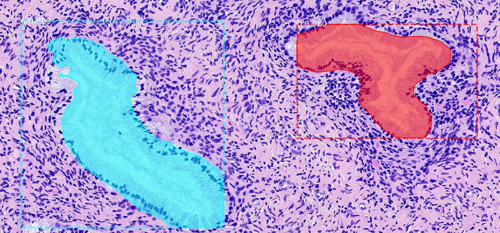

# 线腔识别
###项目数据目录:
<pre>
├─ gland
│ ├─ dataset
│ │ ├─ 1_json
│ ├─ img
│ ├─ json
│ └─ mask
</pre>
dataset包含各个json转出单个文件夹, img是原图文件夹,json是脚本文件夹, mask是对应原图序号的mask图文件夹

### 7-5
Mask_RCNN可使用灰度图进行训练，但验证集需要使用RGB图像，目前效果最好为5-11训练模型(基于RGB的腺体整体识别模型) 
模型验证图中出现重叠，初步预计为anchor设置问题，导致不同尺寸仍被识别 (<b>已解决</b>) 
识别到非线腔区域，如血管，暂未解决方案 
<!--  -->
 

### 7-8
5-11的训练模型已上传至<a href=http://dreamdarker.top:8000/d/d72652e7f38f4126b0a3/>云</a>, 下载后可在validation.py中修改加载权重的模型路径来验证测试 
调整识别区域, 尝试使用腺体周围边界在灰度图上进行训练 

 

### 7-9   (已放弃)
training.py代码修改，提取png(而非jpg)作为原图，进行训练 
尝试提取G通道对整体进行识别训练，获得了比5-11的model更好的效果，但重叠问题和识别错误仍然存在 

 

### 7-11
添加path.py，更方便对traning.py的路径修改
新增两份bat脚本，针对json转出dataset和提取dataset中mask图(或原图)，修改路径即可使用

### 9-8
对gland进行更细致分类：分为good和bad两类，进行识别处理 

 
添加对原图做旋转、翻转处理，以获取更多的图片，具体见<a href="https://github.com/DreamDarker/RGB_Trans">RGB_trans</a>项目
三份bat脚本分别为json_to_dataset的提取，dataset中img和mask的提取，以及对应旋转/翻转图的json的提取